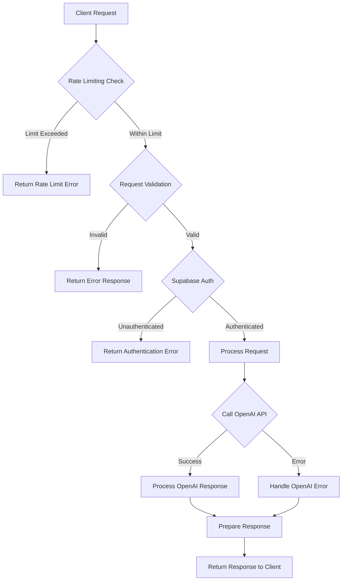
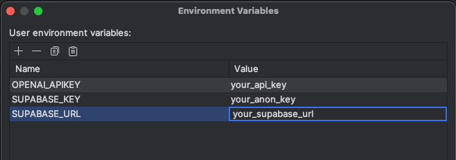

# BookMatch-Ktor-Backend

Welcome to the BookMatch Backend API—the brain behind keeping the AI-powered book recommendations safe and secure! This API serves as a protective gateway for [BookMatch](https://github.com/novumlogic/BookMatch), app that uses generative AI to deliver personalized book recommendations. The backend ensures that all sensitive API keys—particularly your OpenAI keys—stay locked behind server walls, shielding them from exposure in client-side code. Whether you're looking to secure your own app with a backend API or want to safeguard BookMatch's backend, this project will guide you every step of the way!


## Tech Stack:

- _[Ktor](https://ktor.io/docs/server-create-a-new-project.html):_ Used for building the API and handling server-side logic.
- _[OpenAI](https://platform.openai.com/docs/guides/chat-completions):_ Utilized for generating recommendation content in json using structured outputs.
- _[Supabase Auth](https://supabase.com/docs/guides/auth)_: For Authentication and Authorization of the API.


### Ktor Plugins Used:
| Plugin | Description |
|---|---|
| [Request Validation](https://ktor.io/docs/server-request-validation.html) | Validates incoming requests to ensure data integrity and adherence to expected formats. |
| [Rate Limiting](https://ktor.io/docs/server-rate-limit.html) | Manages and limits the number of requests to prevent abuse and ensure fair usage. |
| [Status Pages](https://ktor.io/docs/server-status-pages.html) | Provides custom error pages and responses for various HTTP status codes, improving debugging and user experience. |
| [Routing ](https://ktor.io/docs/server-routing.html)| Defines and handles API routes, facilitating request handling and routing logic. |
| [Content Serialization](https://ktor.io/docs/server-serialization.html) | Manages JSON serialization and deserialization for efficient data exchange between client and server. |


## Features:
- **Secure API Key Handling:** Keeps OpenAI API keys on the server-side to prevent exposure.
- **Proxy Requests:** Forwards client requests to OpenAI while managing all authentication and security.
- **Kotlin & Ktor Framework:** Uses Kotlin with the Ktor framework for an efficient and lightweight backend.


## Workflow: 



## Project Structure:

```
src/
└── main/
    ├── kotlin/
    │   └── com.novumlogic.bookmatch.backend/
    │       ├── data/
    │       │   └── OpenAiClient
    │       ├── model/
    │       │   ├── request/
    │       │   │   ├── OpenAiRequest.kt
    │       │   │   └── RecommendationRequest.kt
    │       │   └── response/
    │       │       ├── ErrorResponse
    │       │       └── OpenAiResponse.kt
    │       ├── plugins/
    │       │   ├── Routing.kt
    │       │   └── Serialization.kt
    │       ├── Constants
    │       └── Application.kt
    └── resources/
        ├── application.yaml
        └── logback.xml
```

Here's a brief overview of the main components:

- [OpenAiClient](../main/src/main/kotlin/com/novumlogic/bookmatch/backend/data/OpenAiClient.kt): Contains logic for interacting with the OpenAI API, you can modify how you want to handle the request here i.e. limit or increase the chat context for api request.
- [model/](../main/src/main/kotlin/com/novumlogic/bookmatch/backend/model): request/ holds model class for our API input body and OpenAI request body. response/ holds model classes for our Response as well as OpenAI API response.
- [plugins/](../main/src/main/kotlin/com/novumlogic/bookmatch/backend/plugins): Includes Routing and Serialization configurations. You can add your endpoints in [Routing.kt](../main/src/main/kotlin/com/novumlogic/bookmatch/backend/plugins/Routing.kt) or modify the logic of how plugins are used.
- [Constants](../main/src/main/kotlin/com/novumlogic/bookmatch/backend/Constants.kt): Contains `system_instruction` for OpenAI request to provide it with role and `response_format` for using OpenAI with [Structured outputs](https://platform.openai.com/docs/guides/structured-outputs/examples) so the json output stays defined and not hallucinate.
- [Application.kt](../main/src/main/kotlin/com/novumlogic/bookmatch/backend/Application.kt): The main entry point of the application.
- [resources/](../main/src/main/resources): Contains configuration files like application.yaml and logback.xml for logging.
  
## Getting Started

### Prerequisites:

- [Intellj Idea](https://www.jetbrains.com/idea/): Provides JDK and Gradle (dependency management and build automation tool) to run the project or any IDE that has this two tools.
- [OpenAI Chat Completion API](https://platform.openai.com/docs/guides/chat-completions): You need an API key from OpenAI to use this services.
- [Supabase Auth Kotlin Client](https://supabase.com/docs/reference/kotlin/auth-api): For Authentication purpose of the API (Since we had setup already backend for client in supabase, supabase was suitable for us but You can also implement your custom authenication)
### Installation:

1. Clone the repository:
```bash
git clone https://github.com/novumlogic/BookMatch-Ktor-Backend.git
cd BookMatch-Ktor-Backend
```

2. Setup Supabase-Auth and OpenAI keys:
  - OpenAI API Key: You'll need to set up your OpenAI API key to interact with the recommendation engine. You can [follow this guide](https://platform.openai.com/api-keys) to get your API key.
  - Supabase Auth: Set up Supabase for authentication and authorization. Get started with [Supabase Auth](https://supabase.com/docs/guides/auth) to manage user access.


3. Set up Environment Variables:
    - In your Intellij Idea IDE, from **main menu** select **Edit Configurations** and your variables
    - 
    - These environment variables [SUPABASE_URL](../main/src/main/kotlin/com/novumlogic/bookmatch/backend/Application.kt), [SUPABASE_KEY](../main/src/main/kotlin/com/novumlogic/bookmatch/backend/Application.kt) and [OPENAI_APIKEY](../main/src/main/kotlin/com/novumlogic/bookmatch/backend/data/OpenAiClient.kt) should be configured correctly in order to run the project.

4. Build the project:
```bash
./gradlew build
```


### Usage

- Starting the Server, run the server using the following command:
```bash
./gradlew run
```

The server will start on http://localhost:8080 by default.

#### Making Requests

Send POST requests to the /generate-recommendations endpoint with the necessary payload to interact with the OpenAI API.


```curl 
curl -X POST http://localhost:8080/generate-recommendations \
-H "Content-Type: application/json" \
-d '{
    "access_token": "eyJabcdiOiJIUzI1Ni12345ZCI6IjZjNHJKeUtSK1ZLeW654msiLCJ0eXAiOiJKV1QifQ.eyJpc3MiOiJodHRwczovL2htcG55anRncWtramd1dGxsc3pwLnN1cGFiYXNlLmNvL2F1dGgvdjEiLCJzdWIiOiI0NWE5NDk5ZS1iY2E1LTQ5YTQtOTI2NS1lN2VkODY4NzI4MjAiLCJhdWQiOiJhdXRoZW50aWNhdGVkIiwiZXhwIjoxNzI1MjkwMDk1LCJpYXQiOjE3MjUyODY0OTUsImVtYWlsIjoiZGhhbmFuamF5Lm5hdmxhbmlAbm92dW1sb2dpYy5jb20iLCJwaG9uZSI6IiIsImFwcF9tZXRhZGF0YSI6eyJwcm92aWRlciI6Imdvb2dsZSIsInByb3ZpZGVycyI6WyJnb29nbGUiXX0sInVzZXJfbWV0YWRhdGEiOnsiYXZhdGFyX3VybCI6Imh0dHBzOi8vbGgzLmdvb2dsZXVzZXJjb250ZW50LmNvbS9hL0FDZzhvY0tRMXhOTHZUY2Iyc0tsalJmd1kxNDctSElSazZFRmVTMjRaRkFqcl95T0phQlBDZz1zOTYtYyIsImVtYWlsIjoiZGhhbmFuamF5Lm5hdmxhbmlAbm92dW1sb2dpYy5jb20iLCJlbWFpbF92ZXJpZmllZCI6dHJ1ZSwiZnVsbF9uYW1lIjoiRGhhbmFuamF5IE5hdmxhbmkiLCJpc3MiOiJodHRwczovL2FjY291bnRzLmdvb2dsZS5jb20iLCJuYW1lIjoiRGhhbmFuamF5IE5hdmxhbmkiLCJwaG9uZV92ZXJpZmllZCI6ZmFsc2UsInBpY3R1cmUiOiJodHRwczovL2xoMy5nb29nbGV1c2VyY29udGVudC5jb20vYS9BQ2c4b2NLUTF4Tkx2VGNiMnNLbGpSZndZMTQ3LUhJUms2RUZlUzI0WkZBanJfeU9KYUJQQ2c9czk2LWMiLCJwcm92aWRlcl9pZCI6IjExMTM5ODAwOTQ3NzA1NjkxNDgwMiIsInN1YiI6IjExMTM5ODAwOTQ3NzA1NjkxNDgwMiJ9LCJyb2xlIjoiYXV0aGVudGljYXRlZCIsImFhbCI6ImFhbDEiLCJhbXIiOlt7Im1ldGhvZCI6Im9hdXRoIiwidGltZXN0YW1wIjoxNzI1MjYwNTc1fV0sInNlc3Npb25faWQiOiI4YmVkMjQ0OS1lYzAyLTQ2MmItOThlMi02ODEyM2QwM2YzMjkiLCJpc19hbm9ueW1vdXMiOmZhbHNlfQ.AeG2PFT2tCF003eNa2Jkv3IXXPjNWyncyUMq8RDl--E" ,
    "messages": [{
    "role": "user",
    "content": "romance, thriller"
    }]
}'
```

Example Response

```json
{
  "data": [
    {
      "genre": "romance",
      "list": [
        {
          "book_name": "Pride and Prejudice",
          "author_name": "Jane Austen",
          "genre_tags": [
            "romance",
            "classic",
            "fiction"
          ],
          "description": "A classic novel that explores the themes of love, reputation, and class in 19th century England as Elizabeth Bennet navigates issues of morality, education, and marriage.",
          "pages": "432",
          "isbn": "978-1503290563",
          "first_date_of_publication": "1813-01-28"
        }
      ]
    },
    {
      "genre": "thriller",
      "list": [
        {
          "book_name": "The Girl with the Dragon Tattoo",
          "author_name": "Stieg Larsson",
          "genre_tags": [
            "thriller",
            "mystery",
            "crime"
          ],
          "description": "A gripping modern mystery revolving around a journalist and a hacker as they investigate a decades-old disappearance, uncovering dark secrets along the way.",
          "pages": "465",
          "isbn": "978-0307949486",
          "first_date_of_publication": "2005-08-01"
        }
      ]
    }
  ]
}
```

### API Endpoints

POST /generate-recommendations: Generate book recommendations based on user preferences.

- Request Payload:
    - access_token: JWT token provided by supabase auth to authenticate the request on server side
    - messages: List of messages to provide context to OpenAI APIs

- Response:
    - Returns a JSON object containing book recommendations for each genre.
 

## Blog post

For more information and insights behind using ktor to build this backend, check out our blog:
- [Building secure API gateway with Ktor](https://medium.com/novumlogic/building-a-secure-api-gateway-with-ktor-9129046cb3c7)


## Contributing
We welcome contributions from the community. Please fork the repository and create a pull request with your changes.

***

Feel free to reach out if you have any questions or need further assistance. Enjoy discovering your next favorite book with BookMatch
